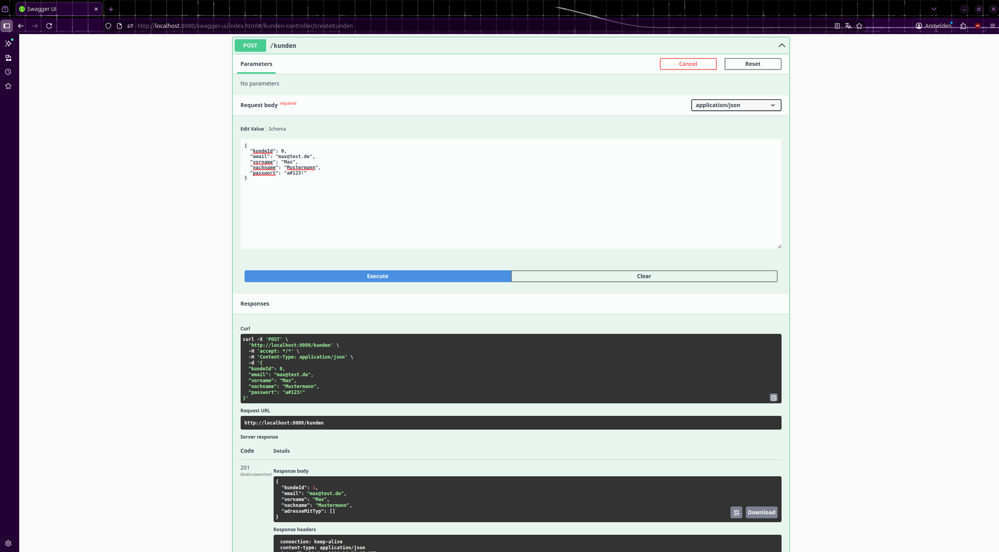
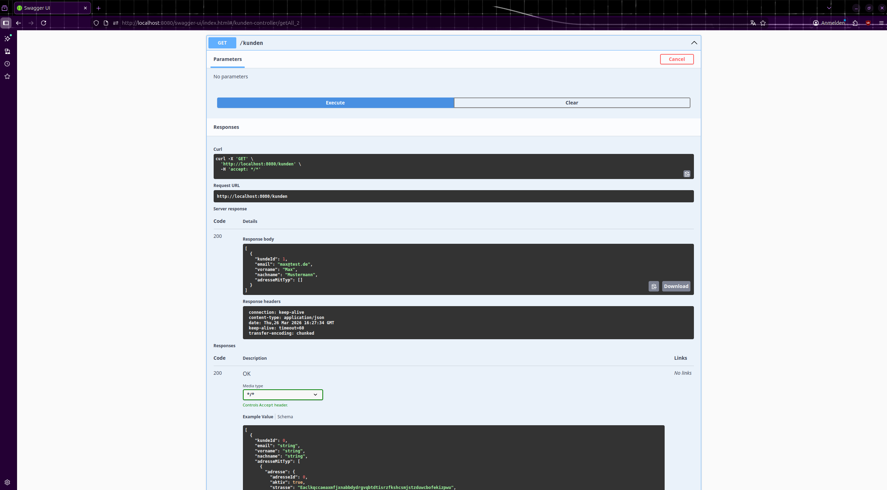
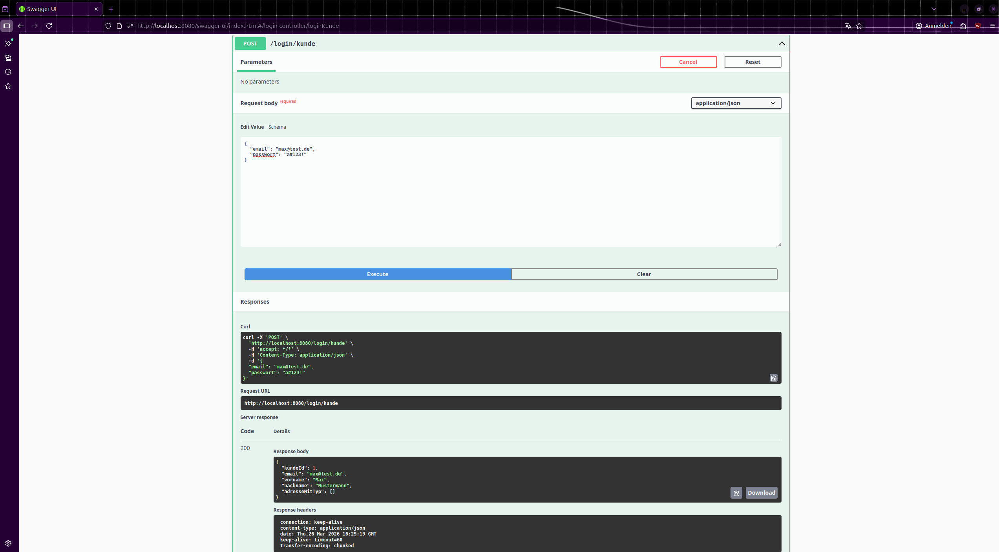

# SIMPLE-SHOP-API

> **Autor**: Marvin0109,
> **aktualisiert am**: 31.03.2026,
> **Version**: 1.5

SIMPLE-SHOP-API ist eine simple REST-API Anwendung, die im Modul *Datenbanken: Weiterführende Konzepte*
als 2-wöchige Abschlussprüfung implementiert werden musste. Sie verwendet **PostgreSQL** als Datenbank
und bietet grundlegende Funktionen für ein einfaches Shop-System an. 

Seit der Abgabe wurde die Anwendung
verbessert in Aspekten wie **Testing**, **Endpoints** und **Passwort-Speicherung**.

> [!NOTE]
> Alle zu bearbeitende Aufgaben in [To-do](TODO.md) sind erledigt und die Weiterentwicklung ist hiermit beendet. 

## Übersicht

- [Funktionen](#funktionen)
- [Tech-Stack](#tech-stack)
- [Vorraussetzungen](#voraussetzungen)
- [Datenbankverbindung](#datenbankverbindung)
- [Installation](#installation)
- [Nutzung](#nutzung)
- [Literatur](#literatur)

## Funktionen

- CRUD für Kunden, Mitarbeiter, Adresse, Produkte, Bestellungen und Bestellpositionen
- Login Feature (Passwortmanagement mit `BCrypt`)

## Tech-Stack

- **Backend:** Spring Boot
- **Datenbank:** PostgreSQL
- **Containerisierung:** Docker + Docker Compose
- **API:** RESTful API (JSON)

## Voraussetzungen

- Docker + Docker Compose
- PostgreSQL Client
- Java 17
- Maven (Optional)
- Unix System / Windows (nicht getestet)

## Datenbankverbindung

Die Anwendung verwendet **JDBC** zur Verbindung mit einer **PostgreSQL-Datenbank**.
Befolgen Sie die Anweisungen in den beiden Dateien `.env.example` und
[application-local-example.properties](/src/main/resources/application-local-example.properties), 
bevor Sie die Anwendung starten.

## Installation

### Linux / macOS

#### 1. Repository klonen (SSH)

```
$ git clone git@github.com:Marvin0109/Simple-Shop-API.git
```

#### 2. Berechtigungen setzen (falls nötig)

```
$ chmod +x start.sh
$ chmod +x clean.sh
$ chmod +x mvnw
```

#### 3. Anwendung starten

```
$ ./start.sh --help # Anzeige von Optionen
```

Die API läuft dann unter `http://localhost:8080`.

#### 4. Anwendung testen

Testen der Endpoints sowie normale Nutzung der Anwendung durch Tools wie [Postman](https://www.postman.com/) 
oder Swagger-UI. Für Beispiele siehe [hier](#nutzung).

#### 5. Anwendung stoppen

- Beenden der Anwendung mit `ctrl+c`

#### 6. Container und Datenbank komplett entfernen

```
$ ./clean.sh --help # Anzeige von Optionen
```

## Nutzung

> [!NOTE]
> Folgende Screenshots zeigen das Testen der Endpoints mit **Swagger-UI** der Anwendung vom Stand **31.03.26**.

### Kunden anlegen



### Kunden anzeigen



### Kunden Login



Für invalide Logins sowie weitere Demos wie Bestellung, Produkte usw. siehe [hier](src/main/resources/demo).

## Literatur

> [!NOTE]
> Manche Anforderungen vom Prüfer sind vereinfacht worden, d.h. 
> dass die aktuelle Version der Anwendung ein Upgrade darstellt.

Dieses Projekt entstand im Rahmen eines Abschlussprojekts.
Der Dozent stellte ein Dokument bereit, welches Installationsanweisungen, 
Anforderungen, API-Endpunkte und Datenbankaufbau beinhaltet.  
(Das Dokument ist urheberrechtlich geschützt und daher nicht öffentlich verfügbar.)

[Zurück zur Übersicht](#übersicht)

